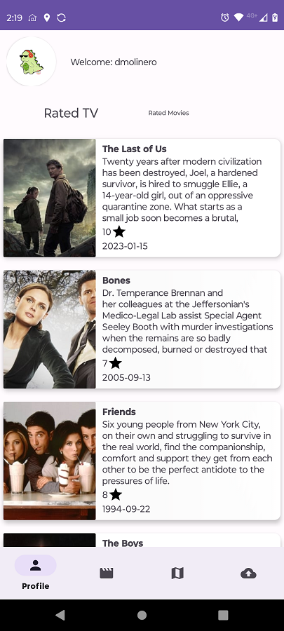
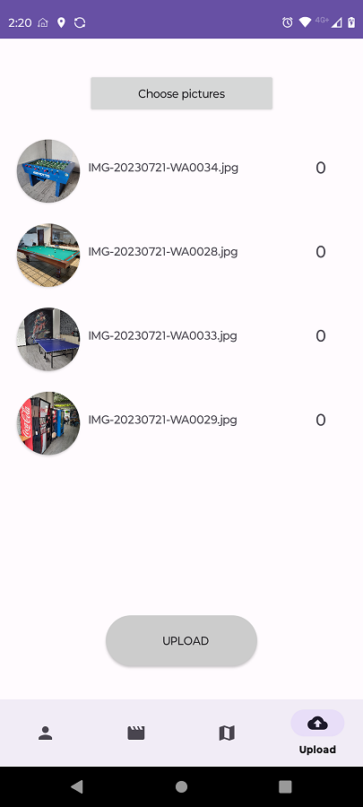

# Movies, Maps and Upload Firebase App

## Descripción

Movies, Maps and Upload Firebase App es una aplicación que te permite explorar y descubrir películas y series de TV. Consume una API de películas y series para obtener datos actualizados y ofrece una variedad de características interesantes.

## Documentación General del Proyecto y Características

- Se usa Retrofit para el consumo de servicios web del API de movies: https://developer.themoviedb.org/ 
- Mostrar listas de películas y series usando RecyclerView y Paging.
- Persistencia de datos utilizando Room para guardar listas de películas y series junto con sus imágenes.
- Bottom Navigation con 4 opciones de navegación: Profile, Movies, Map, Upload.
- Uso de la arquitectura MVVM para una separación clara entre la lógica de negocio y la interfaz de usuario.
- Implementación de Coroutines para realizar tareas asíncronas de manera sencilla.
- Solicitud de permisos para acceder a la ubicación del dispositivo y notificar al usuario cuando se guarda una nueva ubicación.
- Componentes importantes de Android Jetpack utilizados: Navigation, Data Binding, Lifecycle, Paging.
- Inyección de dependencias con Dagger Hilt para una gestión eficiente de las dependencias.
- Material desing y uso de ConstraintLayout para una interfaz de usuario atractiva y adaptable.
- Estilos y dimensiones personalizadas para una apariencia coherente en toda la aplicación.
- FragmentDialog para mostrar errores y casos de excepción.
- Marcador personalizado en el mapa para indicar la ubicación actual.
- Uso de Firebase database para guardar ubicaciones actuales del usuario y Firebase storage para almacenar imagenes seleccionadas del dispositivo.

## Flujo y Capturas de Pantalla

A continuación, se muestran algunas capturas de pantalla de la aplicación ejemplificando el flujo de la misma.

La aplicación tiene un MainActivity que almacena y se encarga de la navegación entre 4 fragmentos que son las vistas principales:

- Profile: Consulta información del perfil como imagen de avatar y username, también consulta la lista de pelícuas calificadas y la lista de series de TV calificadas. La lista de peliculas y series de TV y su imagen se guardan en la base de datos interna con Room y se recuperan en caso de que el usuario no tenga conexióna internet.

|  |  

- Movies: Consulta la lista de pelícuas populares, la lista de peliculas mejor calificadas y la lista de películas recomendadas. Su consulta se hace con Paging para poder ir consultado las siguientes peliculas de la lista sin necesidad de agregar más interacción para el usuario. La lista de peliculas por tipo y su imagen se guardan en la base de datos interna con Room y se recuperan en caso de que el usuario no tenga conexióna internet.

- Map: Muestra el mapa y solicita permisos de ubicación al usuario para poder registrar su ubicación cada 5 minutos, cuando obtiene su ubiación la camara se mueve a la ubicación actual. Cada vezxz que se obtiene un ubicación se notifica al usuario con una notificación push y se guarda en Firestore databse con un timestamp actual.

|  |    |  

- Upload: Permite al usuario seleccionar una o varias imagenes del dispositvo y subirlas a Firebase Storage para su almacenamiento. Se usa Fragment Dialog para notificar en casos de excepción.

|  |    |    |  

En futuras versiones del proyecto, consideramos las siguientes mejoras y adiciones:

- Mejorar el rendimiento de la aplicación mediante la optimización de las solicitudes a la API y la gestión eficiente de recursos.
- Solicitar permiso para mostrar notificaciones en dispositivos con Android 11 y versiones posteriores.
- Obtener más datos del usuario, como sus películas y series favoritas, para personalizar aún más la experiencia.
- Agregar un FragmentDialog para mostrar información detallada de una película o serie al tocarla en la lista.
- Personalizar aún más el marcador en el mapa para proporcionar más información sobre la ubicación.
- Permitir que el usuario configure el tiempo de actualización de ubicación en el archivo de configuración.
- Implementar restricciones en la selección de imágenes al subir y mejorar la interfaz de usuario en todas las pantallas.

¡Esperamos que disfrutes usando Mi App tanto como disfrutamos creándola! Si tienes alguna sugerencia o comentario, no dudes en contactarnos.

